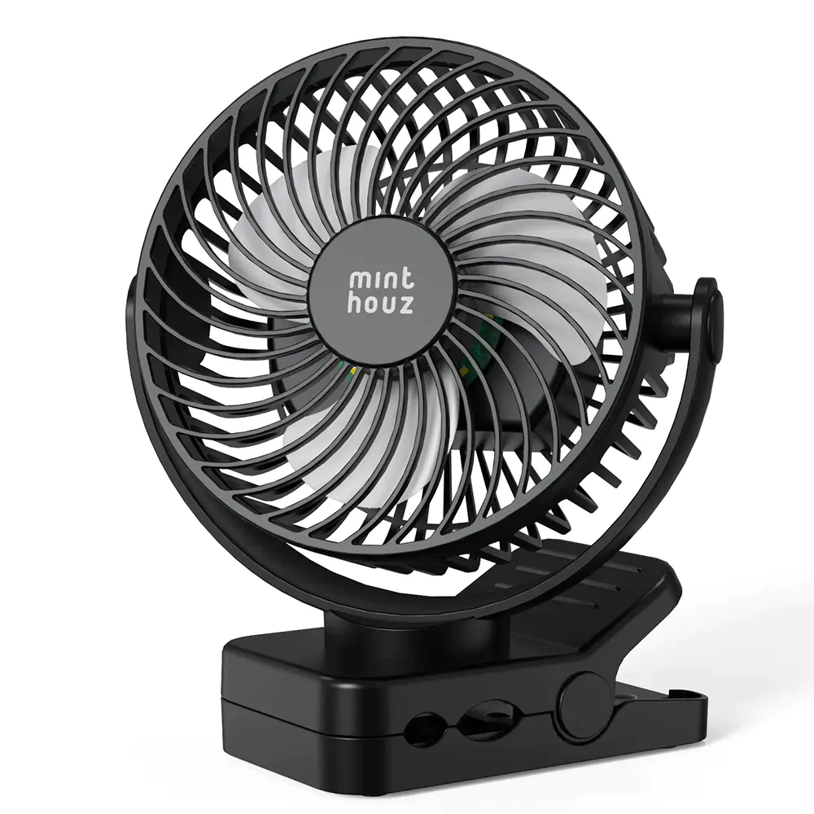
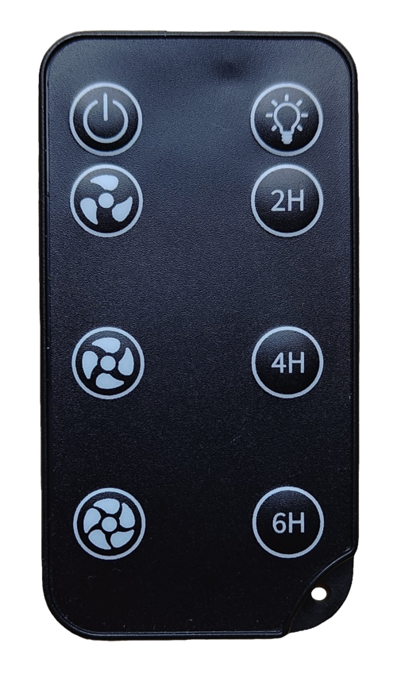

# Minthouz Fano P12L Fan (IR) for Home Assistant

A custom Home Assistant integration that controls a **Minthouz Fano P12L**
clip fan (an unbranded/generic NEC-IR remote fan, likely shared by many
rebadged clones) through Home Assistant's built-in **Infrared** building-block
integration.

It does not talk to hardware directly — it sends commands through whichever
`infrared.*` emitter entity you already have set up (e.g. an ESPHome device
using the `infrared`/`ir_rf_proxy` platform, pointed at a real IR LED).

 

## Hardware

|  |  |
|---|---|
| **Product** | [Minthouz Fano P12L — 12000mAh Portable Fan with Clip](https://www.minthouz.com/12000mah-portable-fan-with-clip-p12l) |
| **Control** | 8-button IR remote (NEC protocol), no Bluetooth/Wi-Fi |
| **Manufacturer** | Minthouz — unofficial/reverse-engineered integration, not affiliated |

  

The 8-button remote this integration replaces.

## Requirements

- Home Assistant **2026.3.0+** (for the `infrared` building-block integration
  and for custom-integration branding support).
- An existing `infrared.*` **emitter** entity in your Home Assistant instance.
  See <https://www.home-assistant.io/integrations/infrared/> for background,
  and ESPHome's experimental `infrared`/`ir_rf_proxy` component for a DIY
  way to build one out of any ESP32 with an IR LED.

## Installation

### HACS (recommended)

1. Click the badge above, or open HACS → Integrations → ⋮ → Custom repositories
   and add `https://github.com/pschmitt/ha-minthouz-fano-ir` as an **Integration**.
2. Install **Minthouz Fano P12L Fan (IR)**, then restart Home Assistant.

### Manual

Copy `custom_components/minthouz_fano` into your Home Assistant
`config/custom_components/` directory and restart.

## Setup

Or: **Settings → Devices & Services → Add Integration → Minthouz Fano P12L Fan
(IR)**, then pick the infrared emitter entity to send commands through.

## Entities

| Entity | Domain | Notes |
|---|---|---|
| Fan | `fan` | Power on/off + 3-speed (`33%`/`66%`/`100%`) |
| LED | `light` | 3 brightness levels; see below — it's a single cycling button |
| Timer 2H / 4H / 6H | `button` | Fires the corresponding timer preset |

## A note on state (and remote quirks)

This remote has **no feedback path** — every state is optimistic/assumed
(`iot_class: assumed_state`). If you use the physical remote (or power-cycle
the fan) alongside this integration, entity state can desync from reality
until the next command is sent from Home Assistant. A few quirks, confirmed
against the real hardware, that the integration accounts for:

- **Power is a toggle.** The `fan` entity tracks assumed on/off state itself.
- **Speed buttons are a no-op while the fan is off** — only the power button
  turns it on. `fan.turn_on`/`set_percentage` sends power first (with a short
  settle delay) when it believes the fan is currently off.
- **Timer buttons *do* turn the fan on** (at speed 1) by themselves when it's
  off — no power press needed. Pressing one updates the `fan` entity's
  assumed state to match.
- **The LED has one physical button, not per-level commands.** Every press
  advances a 4-state cycle: off → low → medium → high → off → ... The `light`
  entity works out how many presses (with a short delay between each) are
  needed to get from its current assumed state to the requested one.

## How the codes were captured

NEC codes were learned off the physical remote using `ir-keytable` against a
USB IR receiver (`address=0x00`, single-byte commands per button — see
`custom_components/minthouz_fano/const.py`). If your remote/fan uses
different codes, this integration will not work as-is.

## License

[GPL-3.0](LICENSE)
